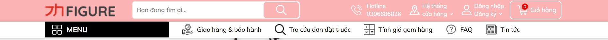
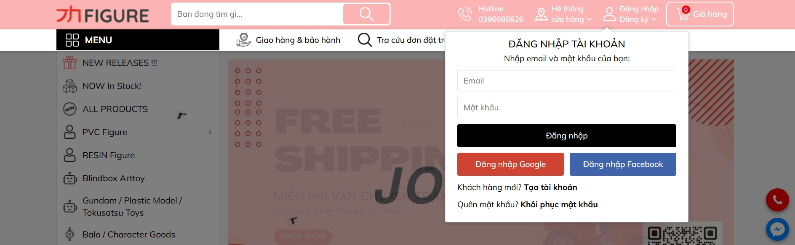

# 🎌 JH Figure Store - Otaku Shop

<div align="center">


**Cửa hàng figure anime chính hãng - E-commerce platform**

Đồ án môn Lập trình Web | Team Dương - Nguyên - Lâm

[Demo](#) · [Report Bug](https://github.com/haizzdungnay/WebSiteOtakuShopVer2/issues) · [Request Feature](https://github.com/haizzdungnay/WebSiteOtakuShopVer2/issues)

</div>

---

## 📋 Mục lục

- [Giới thiệu](#-giới-thiệu)
- [Tính năng](#-tính-năng)
- [Demo & Screenshots](#-demo--screenshots)
- [Công nghệ](#-công-nghệ-sử-dụng)
- [Cài đặt](#-cài-đặt)
- [Cấu trúc project](#-cấu-trúc-project)
- [API Documentation](#-api-documentation)
- [Design System](#-design-system)
- [Môi trường](#-môi-trường-development)
- [Scripts](#-npm-scripts)
- [Docker](#-docker)
- [Deployment](#-deployment)
- [Testing](#-testing)
- [Troubleshooting](#-troubleshooting)
- [Contributing](#-contributing)
- [Team](#-team)
- [License](#-license)

---

## 🎯 Giới thiệu

**JH Figure Store** là một nền tảng e-commerce hiện đại chuyên về figure anime, manga và các sản phẩm collectibles chính hãng. Website được xây dựng với Next.js 15, React 19, và PostgreSQL, tập trung vào trải nghiệm người dùng mượt mà và hiệu suất cao.

### Điểm nổi bật

- 🎨 **UI/UX đẹp mắt** - Thiết kế theo phong cách jhfigure.com với màu hồng/coral đặc trưng
- ⚡ **Hiệu suất cao** - Server-side rendering với Next.js 15 App Router
- 🔐 **Bảo mật tốt** - JWT authentication, CSRF protection, XSS prevention
- 📱 **Fully Responsive** - Hoạt động mượt mà trên mọi thiết bị
- 🐳 **Docker ready** - Dễ dàng deploy với Docker Compose
- 🎁 **Hot/New/Sale** - Quản lý sản phẩm theo trạng thái

---

## ✨ Tính năng

### 🛍️ E-Commerce Core
- ✅ Danh sách sản phẩm với filter & search
- ✅ Chi tiết sản phẩm với gallery
- ✅ Giỏ hàng (shopping cart)
- ✅ Wishlist (yêu thích)
- ✅ Product categories (Nendoroid, Scale Figure, PVC, etc.)
- ✅ Hot/New/Sale badges
- ✅ Price display với discount

### 👤 User Management
- ✅ Đăng ký tài khoản
- ✅ Đăng nhập / Đăng xuất
- ✅ JWT authentication
- ✅ Protected routes
- ✅ User profile
- ⏳ Social login (Google, Facebook) - Coming soon

### 🎨 UI/UX Features
- ✅ Modern pink/coral theme
- ✅ Smooth animations & transitions
- ✅ Product hover effects
- ✅ Responsive sidebar navigation
- ✅ Search bar with auto-complete
- ✅ Mobile-friendly menu
- ✅ Custom scrollbar
- ✅ Loading states

### 🛡️ Security Features
- ✅ Password hashing với bcryptjs
- ✅ JWT token authentication
- ✅ CSRF token protection
- ✅ XSS prevention (input sanitization)
- ✅ SQL injection prevention
- ✅ Secure HTTP headers
- ✅ Environment-based secrets

---

## 📸 Demo & Screenshots

### Homepage


### Header


### Login Page


---

## 🛠️ Công nghệ sử dụng

### Frontend
```
Next.js 15        - React framework with App Router
React 19          - UI library
TypeScript 5      - Type safety
Tailwind CSS 3    - Utility-first CSS
Lucide React      - Icon library
```

### Backend
```
Next.js API Routes  - Serverless functions
PostgreSQL 15       - Relational database
JWT                - Authentication tokens
bcryptjs           - Password hashing
```

### DevOps
```
Docker            - Containerization
Docker Compose    - Multi-container orchestration
Git               - Version control
```

---

## 🚀 Cài đặt

### Yêu cầu hệ thống

- **Node.js** >= 18.0.0
- **npm** >= 9.0.0
- **Docker Desktop** (khuyến nghị)
- **PostgreSQL** 15+ (hoặc dùng Docker)
- **Git**

### Method 1: Cài đặt nhanh (Khuyến nghị)

```bash
# 1. Clone repository
git clone https://github.com/haizzdungnay/WebSiteOtakuShopVer2.git
cd WebSiteOtakuShopVer2

# 2. Install dependencies
npm install

# 3. Setup environment
cp .env.example .env.local
# Sửa .env.local với thông tin database của bạn

# 4. Start database (Docker)
docker-compose up postgres -d

# 5. Run development server
npm run dev
```

Mở trình duyệt: **http://localhost:3000**

### Method 2: Full Docker Setup

```bash
# Clone repository
git clone https://github.com/haizzdungnay/WebSiteOtakuShopVer2.git
cd WebSiteOtakuShopVer2

# Build và start tất cả services
docker-compose up -d

# Xem logs
docker-compose logs -f nextjs
```

**Services URLs:**
- Next.js: http://localhost:3000
- PostgreSQL: localhost:5432
- PHP Legacy: http://localhost:8080

### Method 3: Manual Setup (Không Docker)

```bash
# 1. Clone repository
git clone https://github.com/haizzdungnay/WebSiteOtakuShopVer2.git
cd WebSiteOtakuShopVer2

# 2. Install PostgreSQL
# Windows: Download từ https://www.postgresql.org/download/
# Mac: brew install postgresql@15
# Linux: sudo apt-get install postgresql-15

# 3. Create database
createdb otakushop
psql otakushop < init.sql

# 4. Install dependencies
npm install

# 5. Setup environment
cp .env.example .env.local
# Sửa DATABASE_URL trong .env.local

# 6. Run development
npm run dev
```

---

## 📁 Cấu trúc project

```
WebSiteOtakuShopVer2/
├── app/                      # Next.js App Router
│   ├── api/                  # API Routes
│   │   ├── auth/            # Authentication endpoints
│   │   │   ├── register/    # POST /api/auth/register
│   │   │   ├── login/       # POST /api/auth/login
│   │   │   ├── logout/      # POST /api/auth/logout
│   │   │   └── me/          # GET /api/auth/me
│   │   └── products/        # Product endpoints
│   │       └── route.ts     # GET, POST /api/products
│   ├── login/               # Login page
│   ├── register/            # Register page
│   ├── products/            # Products listing page
│   ├── layout.tsx           # Root layout
│   ├── page.tsx             # Homepage
│   └── globals.css          # Global styles
│
├── components/              # React Components
│   ├── Header.tsx          # Main header with search
│   ├── Footer.tsx          # Footer section
│   ├── Sidebar.tsx         # Category sidebar
│   ├── ProductCard.tsx     # Product display card
│   └── FloatingButtons.tsx # Floating action buttons
│
├── contexts/               # React Context
│   └── AuthContext.tsx    # Authentication state
│
├── lib/                    # Utility libraries
│   ├── db.ts              # PostgreSQL connection
│   ├── jwt.ts             # JWT utilities
│   ├── csrf.ts            # CSRF protection
│   └── sanitize.ts        # XSS prevention
│
├── types/                  # TypeScript types
│   └── product.ts         # Product interfaces
│
├── public/                 # Static files
│   ├── images/            # Image assets
│   └── php/               # PHP legacy (optional)
│
├── design-reference/       # Design mockups
│   ├── home_page.jpeg
│   ├── header.jpeg
│   └── login.jpeg
│
├── docker-compose.yml      # Docker orchestration
├── Dockerfile             # Next.js container
├── Dockerfile.php         # PHP container (optional)
├── init.sql               # Database schema
├── middleware.ts          # Next.js middleware
├── next.config.js         # Next.js config
├── tailwind.config.ts     # Tailwind config
├── tsconfig.json          # TypeScript config
└── package.json           # Dependencies

```

---

## 📡 API Documentation

### Base URL

```
Development: http://localhost:3000/api
Production:  https://yourdomain.com/api
```

### Authentication Endpoints

#### 1. Register User

**POST** `/api/auth/register`

**Request Body:**
```json
{
  "email": "user@example.com",
  "username": "username",
  "password": "password123",
  "fullName": "Full Name"
}
```

**Response:** `201 Created`
```json
{
  "success": true,
  "message": "Registration successful",
  "user": {
    "id": 1,
    "email": "user@example.com",
    "username": "username",
    "fullName": "Full Name"
  },
  "token": "eyJhbGciOiJIUzI1NiIsInR5cCI6IkpXVCJ9..."
}
```

#### 2. Login User

**POST** `/api/auth/login`

**Request Body:**
```json
{
  "email": "user@example.com",
  "password": "password123"
}
```

**Response:** `200 OK`
```json
{
  "success": true,
  "user": {
    "id": 1,
    "email": "user@example.com",
    "username": "username"
  },
  "token": "eyJhbGciOiJIUzI1NiIsInR5cCI6IkpXVCJ9..."
}
```

#### 3. Get Current User

**GET** `/api/auth/me`

**Headers:**
```
Authorization: Bearer {token}
```

**Response:** `200 OK`
```json
{
  "success": true,
  "user": {
    "id": 1,
    "email": "user@example.com",
    "username": "username",
    "fullName": "Full Name"
  }
}
```

#### 4. Logout

**POST** `/api/auth/logout`

**Headers:**
```
Authorization: Bearer {token}
```

**Response:** `200 OK`
```json
{
  "success": true,
  "message": "Logged out successfully"
}
```

### Product Endpoints

#### 1. Get All Products

**GET** `/api/products?category=nendoroid&limit=20&search=miku`

**Query Parameters:**
- `category` (optional): Filter by category
- `limit` (optional): Limit results (default: 50)
- `search` (optional): Search by name

**Response:** `200 OK`
```json
{
  "success": true,
  "products": [
    {
      "id": "1",
      "name": "Nendoroid Hatsune Miku",
      "price": 850000,
      "discountPrice": 595000,
      "image": "/images/products/product1.jpg",
      "category": "nendoroid",
      "badge": "hot",
      "stock": 10,
      "slug": "nendoroid-miku-2024"
    }
  ],
  "total": 100
}
```

#### 2. Create Product (Protected)

**POST** `/api/products`

**Headers:**
```
Authorization: Bearer {token}
Content-Type: application/json
```

**Request Body:**
```json
{
  "name": "Nendoroid Hatsune Miku",
  "description": "High quality Nendoroid figure",
  "price": 850000,
  "discountPrice": 595000,
  "category": "nendoroid",
  "stock": 10,
  "images": ["/images/products/product1.jpg"]
}
```

**Response:** `201 Created`

---

## 🎨 Design System

### Color Palette

```css
/* Primary Colors - Pink/Coral Theme */
--primary:       #FFB6C1  /* Light Pink */
--primary-light: #FFC0CB  /* Lighter Pink */
--primary-dark:  #FF8FAB  /* Dark Pink */
--primary-50:    #FFE5ED  /* Very Light */
--primary-100:   #FFD5DC  /* Light */

/* Accent Colors */
--accent-red:    #FF4444  /* Hot Badge, Sale Price */
--accent-orange: #FF9966  /* Sale Badge */
--accent-pink:   #FFB6C1  /* Links, Highlights */
--accent-coral:  #FFE5ED  /* Backgrounds */

/* Text Colors */
--text-dark:     #333333  /* Primary Text */
--text-gray:     #666666  /* Secondary Text */

/* Background Colors */
--bg-light:      #F5F5F5  /* Page Background */
--bg-white:      #FFFFFF  /* Card Background */
```

### Typography

```css
/* Font Family */
font-family: system-ui, -apple-system, BlinkMacSystemFont, 'Segoe UI', sans-serif;

/* Font Sizes */
Heading 1:  text-4xl (36px)
Heading 2:  text-2xl (24px)
Heading 3:  text-xl (20px)
Body:       text-base (16px)
Small:      text-sm (14px)
Tiny:       text-xs (12px)
```

### Components

#### Buttons
```tsx
// Primary Button - Black
<button className="btn-primary">Click me</button>

// Secondary Button - Pink Outline
<button className="btn-secondary">Click me</button>

// Accent Button - Red
<button className="btn-accent">Click me</button>
```

#### Badges
```tsx
// HOT Badge
<span className="badge badge-hot">HOT</span>

// NEW Badge
<span className="badge badge-new">NEW</span>

// SALE Badge
<span className="badge badge-sale">-20%</span>
```

#### Product Card
```tsx
<div className="product-card">
  
  <div className="p-3">
    <h3>Product Name</h3>
    <div className="price-sale">595.000₫</div>
  </div>
</div>
```

---

## 🌍 Môi trường Development

### Environment Variables

Tạo file `.env.local` với nội dung:

```env
# Database
DB_HOST=localhost
DB_PORT=5432
DB_NAME=otakushop
DB_USER=postgres
DB_PASSWORD=postgres

# JWT
JWT_SECRET=your-super-secret-jwt-key-change-in-production-minimum-32-characters
JWT_EXPIRES_IN=7d

# Next.js
NODE_ENV=development
NEXT_TELEMETRY_DISABLED=1

# API (optional)
API_URL=http://localhost:3000/api
```

### Database Schema

Database được tự động khởi tạo từ file `init.sql` khi chạy Docker lần đầu.

**Tables:**
- `users` - User accounts
- `products` - Product catalog
- `categories` - Product categories
- `orders` - Customer orders
- `order_items` - Order details

---

## 📝 NPM Scripts

```bash
# Development
npm run dev            # Start dev server (http://localhost:3000)
npm run build          # Build for production
npm run start          # Start production server
npm run lint           # Run ESLint

# Docker
npm run docker:build   # Build Docker images
npm run docker:up      # Start all containers
npm run docker:down    # Stop all containers
```

---

## 🐳 Docker

### Docker Compose Services

| Service | Container Name | Port | Description |
|---------|---------------|------|-------------|
| nextjs | otakushop-app | 3000 | Next.js application |
| postgres | otakushop-db | 5432 | PostgreSQL database |
| php | otakushop-php | 8080 | PHP legacy (optional) |

### Docker Commands

```bash
# Start all services
docker-compose up -d

# Start specific service
docker-compose up postgres -d

# View logs
docker-compose logs -f nextjs

# Stop all services
docker-compose down

# Rebuild images
docker-compose build --no-cache

# Shell into container
docker-compose exec nextjs sh

# Database shell
docker exec -it otakushop-db psql -U postgres -d otakushop

# Clean up everything
docker-compose down -v
docker system prune -a
```

---

## 🚀 Deployment

### Vercel (Khuyến nghị)

```bash
# Install Vercel CLI
npm i -g vercel

# Deploy
vercel

# Deploy to production
vercel --prod
```

### Docker Deployment

```bash
# Build production images
docker-compose -f docker-compose.prod.yml build

# Start production
docker-compose -f docker-compose.prod.yml up -d
```

---

## 🧪 Testing

### Manual API Testing với curl

```bash
# Register
curl -X POST http://localhost:3000/api/auth/register \
  -H "Content-Type: application/json" \
  -d '{"email":"test@test.com","username":"test","password":"123456","fullName":"Test User"}'

# Login
curl -X POST http://localhost:3000/api/auth/login \
  -H "Content-Type: application/json" \
  -d '{"email":"test@test.com","password":"123456"}'

# Get products
curl http://localhost:3000/api/products
```

### Testing với Postman

Import file `postman_collection.json` vào Postman để test API.

---

## ❓ Troubleshooting

### Lỗi thường gặp

#### 1. Port 3000 đã được sử dụng

```bash
# Windows
netstat -ano | findstr :3000
taskkill /PID <PID> /F

# Mac/Linux
lsof -ti:3000 | xargs kill -9
```

#### 2. Database connection failed

```bash
# Check PostgreSQL đang chạy
docker ps | grep postgres

# Restart PostgreSQL
docker-compose restart postgres

# Check logs
docker-compose logs postgres
```

#### 3. npm install lỗi

```bash
# Clear cache
npm cache clean --force
rm -rf node_modules package-lock.json
npm install
```

#### 4. CSS không load

```bash
# Rebuild
rm -rf .next
npm run build
npm run dev
```

---

## 🤝 Contributing

Contributions are welcome! Follow these steps:

1. Fork the repository
2. Create feature branch (`git checkout -b feature/AmazingFeature`)
3. Commit changes (`git commit -m 'Add some AmazingFeature'`)
4. Push to branch (`git push origin feature/AmazingFeature`)
5. Open a Pull Request

---

## 👥 Team

<table>
  <tr>
    <td align="center">
      
      <br /><b>Dương</b>
      <br />Full-Stack Developer
    </td>
    <td align="center">
      
      <br /><b>Nguyên</b>
      <br />Backend Developer
    </td>
    <td align="center">
      
      <br /><b>Lâm</b>
      <br />Frontend Developer
    </td>
  </tr>
</table>

---

## 📜 License

```
ISC License

Copyright (c) 2025 Team Dương - Nguyên - Lâm

Permission to use, copy, modify, and/or distribute this software for any
purpose with or without fee is hereby granted, provided that the above
copyright notice and this permission notice appear in all copies.
```

---

## 📞 Support & Contact

- 📧 Email: support@jhfigure.com
- 🐛 Issues: [GitHub Issues](https://github.com/haizzdungnay/WebSiteOtakuShopVer2/issues)
- 💬 Discussions: [GitHub Discussions](https://github.com/haizzdungnay/WebSiteOtakuShopVer2/discussions)

---

<div align="center">

**⭐ Nếu project hữu ích, hãy star repo này! ⭐**

Made with ❤️ by Team Dương - Nguyên - Lâm

</div>
