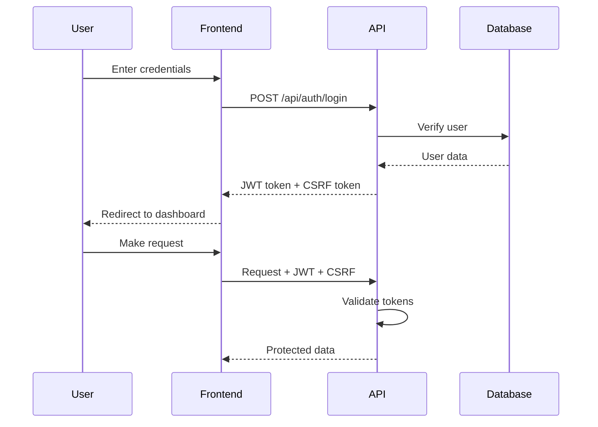

# 🎌 Figure Store - Otaku Shop E-Commerce Platform


> 🎨 Modern full-stack e-commerce platform for anime figures, manga collectibles & otaku merchandise
> 
> 💼 Đồ án môn Lập trình Web - Team Dương - Nguyên - Lâm

<div align="center">
  
</div>

---

## ✨ Features

### 🎯 Core Features
- 🛍️ **E-Commerce Platform** - Complete shopping experience for anime figures
- 🎨 **Modern UI/UX** - Beautiful pink/coral themed design with Tailwind CSS
- ⚛️ **Next.js 15 + React 19** - Latest React framework with App Router
- 🔐 **JWT Authentication** - Secure user authentication system
- 💳 **Shopping Cart** - Add to cart, wishlist, and checkout functionality
- 📱 **Fully Responsive** - Mobile-first design, works on all devices
- ⚡ **Flash Sale** - Real-time countdown timer for special offers
- 🔍 **Product Search** - Advanced search and filtering
- 📦 **Product Categories** - Nendoroid, Scale Figures, PVC, Pre-orders

### 🛡️ Security Features
- ✅ JWT authentication with secure token handling
- ✅ CSRF token protection
- ✅ XSS protection through input sanitization
- ✅ SQL injection prevention
- ✅ Password hashing with bcryptjs
- ✅ Secure HTTP headers
- ✅ Environment-based secrets

### 🎨 UI Components
- Hero banner with decorative elements
- Info boxes with gradient backgrounds
- Product cards with hover effects
- Character category carousel
- Flash sale section with countdown
- Footer with newsletter signup
- Responsive navigation

---

## 🚀 Quick Start

### Prerequisites

- **Node.js** 18+ 
- **npm** or **yarn**
- **PostgreSQL** 15+ (optional with Docker)
- **Git**

### Installation Methods

#### 🌟 Method 1: Full Next.js Setup (Recommended for Production)

```bash
# 1. Clone the repository
git clone https://github.com/haizzdungnay/WebSiteOtakuShopVer2.git
cd WebSiteOtakuShopVer2

# 2. Run auto-setup script
# Windows:
full-nextjs-setup.bat

# Linux/Mac:
chmod +x full-nextjs-setup.sh
./full-nextjs-setup.sh

# 3. Install dependencies
npm install

# 4. Copy components from integration package
# See FULL-NEXTJS-QUICK-START.md for details

# 5. Set up environment
cp .env.example .env.local
# Edit .env.local with your database credentials

# 6. Import database
mysql -u root -p < database.sql

# 7. Run development server
npm run dev
```

Access at: **http://localhost:3000**

#### ⚡ Method 2: Hybrid Setup (PHP + Next.js)

```bash
# 1. Clone repository
git clone https://github.com/haizzdungnay/WebSiteOtakuShopVer2.git
cd WebSiteOtakuShopVer2

# 2. Run hybrid setup
# Windows:
hybrid-setup.bat

# Linux/Mac:
chmod +x hybrid-setup.sh
./hybrid-setup.sh

# 3. Install dependencies
npm install

# 4. Import database
mysql -u root -p < public/php/database.sql

# 5. Run both Next.js and PHP
npm run dev:all
```

Access at:
- Next.js: **http://localhost:3000**
- PHP Shop: **http://localhost:3000/php/index.php**

#### 🐳 Method 3: Docker Setup

```bash
# Start all services with Docker
docker-compose up -d

# Access services
# - Next.js: http://localhost:3000
# - PHP: http://localhost:8080
# - PostgreSQL: localhost:5432
```

---

## 📁 Project Structure

```
WebSiteOtakuShopVer2/
├── app/                          # Next.js App Router
│   ├── api/                      # API Routes
│   │   ├── auth/                # Authentication endpoints
│   │   │   ├── register/
│   │   │   ├── login/
│   │   │   └── logout/
│   │   └── products/            # Product endpoints
│   │       ├── route.ts         # GET all, POST create
│   │       └── [id]/            # GET, PUT, DELETE by ID
│   ├── login/                    # Login page
│   ├── register/                 # Registration page
│   ├── products/                 # Products listing page
│   │   ├── page.tsx             # Products list
│   │   └── [slug]/              # Product detail
│   │       └── page.tsx
│   ├── cart/                     # Shopping cart
│   │   └── page.tsx
│   ├── layout.tsx                # Root layout
│   ├── page.tsx                  # Homepage
│   └── globals.css               # Global styles
│
├── components/                   # React Components
│   ├── Header.tsx               # Navigation header
│   ├── Footer.tsx               # Footer with links
│   ├── ProductCard.tsx          # Product display card
│   └── sections/                # Page sections
│       ├── HeroBanner.tsx       # Hero section
│       ├── InfoBoxes.tsx        # Info boxes grid
│       ├── FlashSale.tsx        # Flash sale section
│       ├── CharacterCategories.tsx
│       ├── HotProducts.tsx
│       ├── InStock.tsx
│       ├── PreOrder.tsx
│       └── NewsSection.tsx
│
├── contexts/                     # React Context
│   └── AuthContext.tsx          # Authentication state
│
├── hooks/                        # Custom React Hooks
│   ├── useProducts.ts           # Product data fetching
│   ├── useCart.ts               # Cart management
│   └── useAuth.ts               # Auth operations
│
├── lib/                          # Utility Libraries
│   ├── db.ts                    # Database connection
│   ├── jwt.ts                   # JWT utilities
│   ├── csrf.ts                  # CSRF protection
│   └── sanitize.ts              # XSS protection
│
├── types/                        # TypeScript Types
│   ├── product.ts               # Product interfaces
│   ├── user.ts                  # User interfaces
│   └── cart.ts                  # Cart interfaces
│
├── public/                       # Static Assets
│   ├── images/                  # Image assets
│   │   ├── products/           # Product images
│   │   ├── characters/         # Character images
│   │   ├── news/               # News images
│   │   └── payment/            # Payment logos
│   └── php/                     # PHP legacy (hybrid mode)
│       ├── index.php
│       ├── config.php
│       └── assets/
│
├── .github/                      # GitHub Configuration
│   └── workflows/
│       └── ci.yml               # CI/CD pipeline
│
├── docs/                         # Documentation
│   ├── FULL-NEXTJS-GUIDE-PART1.md
│   ├── FULL-NEXTJS-GUIDE-PART2.md
│   ├── FULL-NEXTJS-QUICK-START.md
│   ├── HYBRID-GUIDE.md
│   ├── HYBRID-QUICK-REF.md
│   └── WINDOWS-SETUP-GUIDE.md
│
├── Dockerfile                    # Next.js container
├── Dockerfile.php                # PHP container
├── docker-compose.yml            # Docker orchestration
├── tailwind.config.ts            # Tailwind configuration
├── next.config.js                # Next.js configuration
├── tsconfig.json                 # TypeScript config
├── package.json                  # Dependencies
├── database.sql                  # Database schema
├── init.sql                      # PostgreSQL init
├── postman_collection.json       # API tests
├── SECURITY.md                   # Security docs
└── README.md                     # This file
```

---

## 🎨 Design System

### Color Palette

```css
Primary:   #FF6B9D (Pink)
Secondary: #FF8FAB (Light Pink)
Accent:    #FF9966 (Orange)
Coral:     #FFE5ED (Light Coral)
Text:      #2C2C2C (Dark Gray)
```

### Typography

- **Font Family**: Inter, Segoe UI, Tahoma, sans-serif
- **Headings**: Bold, 2xl to 8xl sizes
- **Body**: Regular, sm to lg sizes

### Components

- **Buttons**: Rounded full, with hover effects
- **Cards**: Shadow on hover, translate-y animation
- **Inputs**: Border with primary color, rounded full
- **Containers**: Max-width 1400px, responsive padding

---

## 🔐 Authentication Flow



---

## 📡 API Documentation

### Base URL
- Development: `http://localhost:3000/api`
- Production: `https://yourdomain.com/api`

### Authentication Endpoints

#### Register User
```http
POST /api/auth/register
Content-Type: application/json

{
  "email": "user@example.com",
  "username": "username",
  "password": "password123",
  "fullName": "Full Name"
}

Response: 201 Created
{
  "success": true,
  "user": { "id": "...", "email": "...", "username": "..." },
  "token": "jwt_token_here"
}
```

#### Login User
```http
POST /api/auth/login
Content-Type: application/json

{
  "email": "user@example.com",
  "password": "password123"
}

Response: 200 OK
{
  "success": true,
  "user": { "id": "...", "email": "...", "username": "..." },
  "token": "jwt_token_here"
}
```

#### Get Current User
```http
GET /api/auth/me
Authorization: Bearer {token}

Response: 200 OK
{
  "success": true,
  "user": { "id": "...", "email": "...", "username": "..." }
}
```

#### Logout
```http
POST /api/auth/logout
Authorization: Bearer {token}

Response: 200 OK
{
  "success": true,
  "message": "Logged out successfully"
}
```

### Product Endpoints

#### Get All Products
```http
GET /api/products?category=nendoroid&limit=10

Response: 200 OK
{
  "success": true,
  "products": [
    {
      "id": "1",
      "name": "Nendoroid...",
      "price": 850000,
      "discountPrice": 595000,
      "image": "/images/products/1.jpg",
      "category": "nendoroid",
      "stock": 10
    }
  ]
}
```

#### Get Single Product
```http
GET /api/products/[slug]

Response: 200 OK
{
  "success": true,
  "product": {
    "id": "1",
    "name": "...",
    "description": "...",
    "price": 850000,
    "images": ["...", "..."]
  }
}
```

#### Create Product (Protected)
```http
POST /api/products
Authorization: Bearer {token}
Content-Type: application/json

{
  "name": "Product Name",
  "description": "Description",
  "price": 850000,
  "category": "nendoroid",
  "stock": 10,
  "images": ["url1", "url2"]
}

Response: 201 Created
```

See [DOCUMENTATION.md](DOCUMENTATION.md) for complete API reference.

---

## 🧪 Testing

### With Postman

1. Import `postman_collection.json`
2. Set environment variables:
   - `base_url`: `http://localhost:3000`
   - `token`: (from login response)
3. Run collection

### Manual Testing

```bash
# Register user
curl -X POST http://localhost:3000/api/auth/register \
  -H "Content-Type: application/json" \
  -d '{"email":"test@example.com","username":"testuser","password":"password123","fullName":"Test User"}'

# Login
curl -X POST http://localhost:3000/api/auth/login \
  -H "Content-Type: application/json" \
  -d '{"email":"test@example.com","password":"password123"}'

# Get products
curl http://localhost:3000/api/products

# Get product by slug
curl http://localhost:3000/api/products/nendoroid-miku
```

---

## 🐳 Docker Commands

```bash
# Build all images
npm run docker:build

# Start services
npm run docker:up

# Stop services
npm run docker:down

# View logs
npm run docker:logs

# Restart service
docker-compose restart web

# Shell into container
docker-compose exec web sh

# Database shell
docker-compose exec postgres psql -U postgres
```

### Docker Compose Services

| Service | Port | Description |
|---------|------|-------------|
| web | 3000 | Next.js application |
| php | 8080 | PHP legacy server |
| postgres | 5432 | PostgreSQL database |

---

## 📝 Development Scripts

```bash
# Development
npm run dev              # Start dev server
npm run dev:all          # Start Next.js + PHP

# Build
npm run build            # Build for production
npm run start            # Start production server

# Code Quality
npm run lint             # Run ESLint
npm run format           # Format with Prettier
npm run type-check       # TypeScript check

# Docker
npm run docker:build     # Build Docker images
npm run docker:up        # Start containers
npm run docker:down      # Stop containers
npm run docker:logs      # View logs

# Database
npm run db:migrate       # Run migrations
npm run db:seed          # Seed database
```

---

## 🛠️ Tech Stack

<table>
<tr>
<td valign="top" width="50%">

### Frontend
- **Next.js 15** - React framework
- **React 19** - UI library  
- **TypeScript 5** - Type safety
- **Tailwind CSS 3** - Utility-first CSS
- **Lucide React** - Icon library
- **Context API** - State management

</td>
<td valign="top" width="50%">

### Backend
- **Next.js API Routes** - Serverless
- **PostgreSQL 15** - Database
- **JWT** - Authentication
- **bcryptjs** - Password hashing
- **Node.js 18+** - Runtime

</td>
</tr>
<tr>
<td valign="top" width="50%">

### DevOps
- **Docker** - Containerization
- **Docker Compose** - Orchestration
- **GitHub Actions** - CI/CD
- **Vercel** - Hosting (optional)

</td>
<td valign="top" width="50%">

### Tools
- **ESLint** - Linting
- **Prettier** - Code formatting
- **Postman** - API testing
- **Git** - Version control

</td>
</tr>
</table>

---

## 📚 Documentation

| Document | Description |
|----------|-------------|
| [FULL-NEXTJS-QUICK-START.md](docs/FULL-NEXTJS-QUICK-START.md) | ⭐ Quick start for full Next.js setup |
| [FULL-NEXTJS-GUIDE-PART1.md](docs/FULL-NEXTJS-GUIDE-PART1.md) | Detailed setup guide part 1 |
| [FULL-NEXTJS-GUIDE-PART2.md](docs/FULL-NEXTJS-GUIDE-PART2.md) | Component creation guide part 2 |
| [HYBRID-GUIDE.md](docs/HYBRID-GUIDE.md) | PHP + Next.js hybrid approach |
| [HYBRID-QUICK-REF.md](docs/HYBRID-QUICK-REF.md) | Quick reference for hybrid |
| [WINDOWS-SETUP-GUIDE.md](docs/WINDOWS-SETUP-GUIDE.md) | ⭐ Windows-specific setup |
| [SECURITY.md](SECURITY.md) | Security best practices |
| [DOCUMENTATION.md](DOCUMENTATION.md) | Complete documentation |

---

## 🎯 Roadmap

### Phase 1: Core Features ✅
- [x] Authentication system
- [x] Product catalog
- [x] Shopping cart
- [x] Responsive design
- [x] Database schema

### Phase 2: Enhanced Features 🚧
- [ ] Payment integration (VNPay, Momo)
- [ ] Order management
- [ ] User profiles
- [ ] Product reviews
- [ ] Wishlist persistence

### Phase 3: Advanced Features 📋
- [ ] Real-time notifications
- [ ] Admin dashboard
- [ ] Analytics
- [ ] Email notifications
- [ ] Social media integration

### Phase 4: Optimization 📋
- [ ] Image optimization
- [ ] SEO improvements
- [ ] Performance tuning
- [ ] PWA support
- [ ] Internationalization

---

## 🤝 Contributing

Contributions are welcome! Please follow these steps:

1. **Fork** the repository
2. **Create** a feature branch
   ```bash
   git checkout -b feature/amazing-feature
   ```
3. **Commit** your changes
   ```bash
   git commit -m 'Add amazing feature'
   ```
4. **Push** to the branch
   ```bash
   git push origin feature/amazing-feature
   ```
5. **Open** a Pull Request

### Development Guidelines

- Follow existing code style
- Write meaningful commit messages
- Add tests for new features
- Update documentation
- Ensure all tests pass

---

## 🐛 Bug Reports

Found a bug? Please open an issue with:

- **Description**: Clear description of the bug
- **Steps to Reproduce**: How to reproduce the issue
- **Expected Behavior**: What should happen
- **Actual Behavior**: What actually happens
- **Screenshots**: If applicable
- **Environment**: OS, Browser, Node version

---

## 💡 Feature Requests

Have an idea? Open an issue with:

- **Feature Description**: What you'd like to see
- **Use Case**: Why it would be useful
- **Possible Implementation**: How it could work
- **Alternatives**: Other solutions considered

---

## 📜 License

This project is licensed under the **ISC License**.

```
ISC License

Copyright (c) 2025 Team Dương - Nguyên - Lâm

Permission to use, copy, modify, and/or distribute this software for any
purpose with or without fee is hereby granted, provided that the above
copyright notice and this permission notice appear in all copies.
```

---

## 👥 Team

<table>
<tr>
<td align="center">

<br /><b>Dương</b>
<br />Backend Development
</td>
<td align="center">

<br /><b>Nguyên</b>
<br />Frontend Development
</td>
<td align="center">

<br /><b>Lâm</b>
<br />Full-Stack Development
</td>
</tr>
</table>

---

## 🙏 Acknowledgments

- **Next.js Team** - Amazing framework
- **Vercel** - Hosting platform
- **Tailwind Labs** - Beautiful CSS framework
- **PostgreSQL Community** - Robust database
- **React Team** - UI library
- **TypeScript Team** - Type safety
- **All Contributors** - For your support

---

## 📞 Support

- 📧 Email: support@figurestore.vn
- 💬 Discord: [Join our server](#)
- 📱 Facebook: [Figure Store Vietnam](#)
- 🐦 Twitter: [@FigureStoreVN](#)

---

## 🌟 Show Your Support

If you like this project, please give it a ⭐ on GitHub!

```bash
# Clone and star
git clone https://github.com/haizzdungnay/WebSiteOtakuShopVer2.git
# Don't forget to star the repo! ⭐
```

---

## 📊 Project Stats


---

<div align="center">

**Made with ❤️ by Team Dương - Nguyên - Lâm**

**Figure Store © 2025**

[⬆ Back to Top](#-figure-store---otaku-shop-e-commerce-platform)

</div>